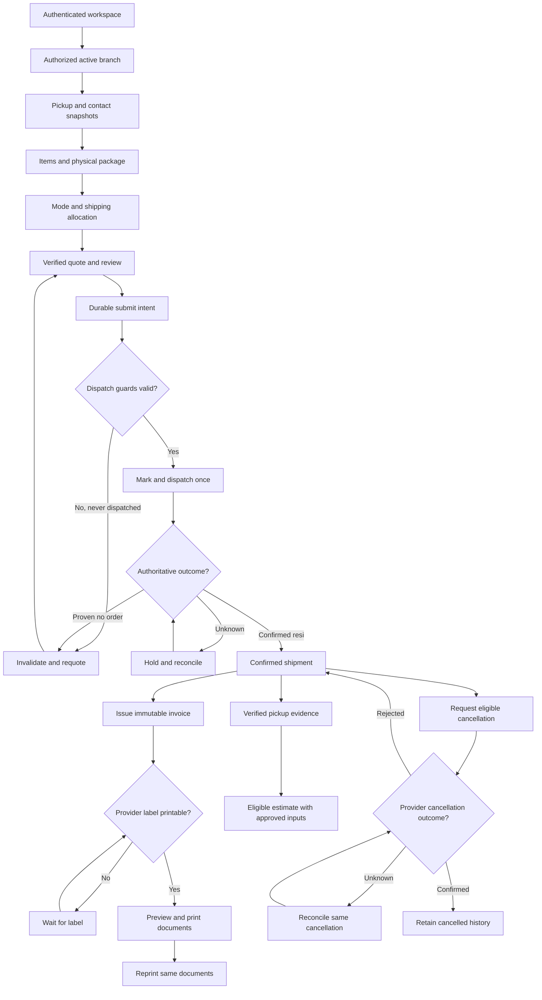

# GeraiHub Technical Design

## Document Control

| Field | Value |
|---|---|
| Status | Accepted technical planning baseline; implementation/provider evidence pending |
| Version / updated | 0.3 / 2026-09-24 |
| Authority | Canonical repository specification; promoted from the retained planning snapshot on 2026-09-23 |
| Scope | Branch-scoped shipment operations with Mengantar integration |

## 1. Design Summary

Build one modular web application and one transactional relational database before considering services. The trusted backend owns authorization, provider calls, idempotency, provider synchronization, print eligibility, audit events, and reconciliation. Browser clients never receive Mengantar credentials or credential-bearing URLs.

The system is organization-aware but branch-operational: an owner may belong to multiple branches; every shipment mutation resolves one authorized branch context. Aggregated organization reports are read-only. Mengantar remains authoritative for provider shipment finance and settlement.

## 2. Component Responsibility Map

| ID | Owner | Component | Responsibility | Owned state | Failure contract |
|---|---|---|---|---|---|
| TD-1 | Engineering owner | Web operator/admin UI | Branch selection, counter workflow, queues, detail, governance surfaces | Local UI state only | Preserve entered form data; show recoverable provider/sync state. |
| TD-2 | Security owner | Auth/context policy | Complete Google OAuth login, resolve provider subject to GeraiHub user/account, resolve membership/active branch, authorize action | GeraiHub session/context/account link | Deny missing, stale, disabled, uninvited, or mismatched scope. |
| TD-3 | Engineering owner | Shipment application module | Draft, quote version, physical verification, invoice snapshot, lifecycle guards | Shipment aggregate | Reject invalid state transition; serialize/guard concurrent mutation. |
| TD-4 | Engineering owner | Mengantar adapter | Sanitize/validate provider requests and responses; estimate, order, status, cancellation/label operations once verified | Provider mapping/sync evidence | Never expose credential; classify timeout/unknown separately from failure; idempotent retry/reconcile. |
| TD-5 | Engineering owner | Dispatch/reconciliation worker | Reliably run provider work and reconcile pending/unknown outcomes | Job/outbox/sync records | Retry bounded transient failure; quarantine mismatches; no blind duplicate order. |
| TD-6 | Engineering owner | Counter print service | Prepare the confirmed provider label/resi and immutable invoice in one authorized print flow; provide separate reprints | Document issue/print-request audit only | Refuse combined print until label is printable and invoice is issued; never alter provider label, create another order/invoice, or assert physical print completion from a browser dialog. |
| TD-7 | Engineering owner | Finance read model | Provider snapshots, mismatch queue, eligible estimated-profit report | Non-authoritative snapshots | Label stale/mismatch/estimate; do not overwrite provider truth. |
| TD-8 | Engineering owner | Audit/observability | Immutable operational/security events and redacted diagnostics | Audit events | Never log secrets/full payloads; alert reconciliation/security failures. |

### TD-9 — Reproducible implementation foundation
- Status: Accepted planning requirement
- Owner: Engineering owner
- Source: NFR-1, NFR-4; terminal-independent delivery constraint in TASKS.md
- Statement: The future repository must pin its selected runtime/package versions and provide documented non-interactive install, lint/typecheck, tests, local startup, migrations, and synthetic seed commands without a proprietary AI/IDE dependency.
- Acceptance: From a clean checkout in an approved local environment, a developer executes the documented commands with declared prerequisites; required checks succeed without live provider writes or production credentials.
- Constraints: SEC-8, SEC-15, PRIV-13
- Change history: Added during planning audit; runtime/deployment baseline accepted by ADR-001 while exact installed versions remain T-1 evidence.

## 3. Key Flows

### TD-10 — Privacy operations readiness
- Status: Accepted planning requirement
- Owner: Engineering owner
- Source: PRIV-10, PRIV-11, PRIV-12
- Statement: Implement the approved notice/version, vendor, retention and internal rights-case controls before production data collection, preserving authorization and audit history.
- Acceptance: T-18 records approved policy references and a synthetic export/deletion/restriction exercise; publishing remains separately authorized.
- Constraints: PRIV-6 through PRIV-13, SEC-14
- Change history: Added to give privacy implementation a technical primary requirement without changing legal approval ownership.

### TD-11 — Recoverable deployment readiness
- Status: Accepted planning requirement
- Owner: Engineering owner
- Source: SEC-13, SEC-14, OBS-3
- Statement: Provide reproducible deployment, restore and rollback/run-forward procedures that preserve tenant history and ambiguous provider operations.
- Acceptance: T-19 executes a synthetic non-production restore and migration/release rehearsal against approved recovery targets.
- Constraints: PRIV-11, SEC-15
- Change history: Added to give operational implementation a technical primary requirement without authorizing deployment.

### Create to print

This flow is a navigation aid for the canonical state guards in `08-STATE-CONCURRENCY-CONTRACT.md`. Provider nodes require the capability evidence in section 7.

The cancellation unknown path means reconciliation of the same request, never sending another cancellation. Local draft cancellation is allowed only before any queued or possibly dispatched create under the state matrix. Invoice issuance may precede label availability, but the combined print action waits for both documents. Historical invoice reprint remains available under its own guard even if the provider label is no longer printable.

1. Server resolves the Google OAuth-authenticated provider subject to a GeraiHub user, then active branch, membership, and action permission.
2. Operator reviews the active gerai pickup point, selects or creates branch-local sender and recipient contacts, enters item lines/declared goods total, and saves a branch-owned draft. The server obtains a current provider estimate only for validated provider-required fields.
3. Operator verifies package values and sender/recipient, origin, item, collection mode, shipping allocation, intended courier COD amount, and charge summary. Non-COD is the default; COD ongkir/produk require per-service verified eligibility. Any material change invalidates prior quote confirmation.
4. Server records physical verification and the confirmed final quote version under one transaction/audit boundary; customer payment remains manual outside GeraiHub.
5. Submission creates one idempotency/correlation record pinned to the quote's provider-account mapping/version. Immediately before dispatch the worker checks freshness/readiness, durably marks dispatch start and sends under the verified provider concurrency strategy. A stale, provably never-dispatched operation returns to review atomically; potentially dispatched operations reconcile only.
6. On provider confirmation, persist tracking/label mapping, transition state, and enable resi/label and invoice issuance. Timeout/ambiguous response stays pending reconciliation with neither document issued.
7. The counter `Cetak resi + invoice` action issues the invoice idempotently if needed, then prepares both documents from the same confirmed shipment. One print-ready job is used only if provider label dimensions/media remain intact; otherwise the operator follows two ordered print steps. Individual reprints reuse the same invoice and provider mapping. A failed print request changes neither document identity nor provider state.

### Cancellation

1. Before provider submission, cancel local draft and retain audit history.
2. After submission/print, authorize cancellation request, validate current provider eligibility, persist `pending_provider`, and dispatch once with provider correlation.
3. Only an authenticated current provider response/reconciliation can mark cancellation succeeded/rejected. Unknown remains visible and actionable for reconciliation.

### Branch switching

1. User selects an authorized branch membership.
2. Server issues/updates validated active context; UI clears branch-sensitive search/cache and shows active branch persistently.
3. Every subsequent query/mutation carries server-derived branch scope. Aggregate reports never provide an operational mutation handle.

## 4. Required State-Transition Guards

- No submission without valid active branch, required verified package data, confirmed current final quote, and no confirmed prior provider order. No customer-payment state is part of the guard.
- No duplicate submit when a prior request is pending/unknown; reconcile first.
- No print/reprint for unconfirmed/non-printable provider state.
- No local “cancelled” state for a submitted order before authoritative provider result.
- No estimated-profit inclusion until the approved pickup evidence is synchronized.
- No role/member change may be self-escalating or cross-branch.

## 5. Interface Boundaries

- Internal operation boundaries and contract gates are defined in `09-API-SPECIFICATION.md`; state/concurrency ownership is defined in `08-STATE-CONCURRENCY-CONTRACT.md`; safe error semantics are defined in `18-ERROR-AND-RESULT-CONTRACT.md`; session and active-branch authority are fixed by ADR-005. Implementation selects the exact HTTP/schema/framework mapping from installed evidence. Do not invent provider cancellation endpoint or payload until current Mengantar contract is verified.
- Provider adapter is server-only and logs sanitized request metadata/outcomes, never credential URL or customer payload.
- Database constraints implement ownership/idempotency invariants from `05-DATA-MODEL.md`.
- Authorization checks use action vocabulary from `07-IAM-RBAC-ABAC.md`, not client-selected role strings.

## 6. Rollout Sequence

1. Identity, organization/branch/membership, active-branch context, and negative authorization tests.
2. Branch-scoped draft/quote/verification/print audit UI using controlled provider integration fixtures.
3. Current documented/sandbox-verified Mengantar estimate and order flow with safe provider-state reconciliation.
4. Cancellation only after endpoint/state/financial effects are verified.
5. Finance backup/reconciliation and picked-up estimated-profit report after authoritative event/status definition is accepted.
6. Customer pre-fill QR/reference only as a separately enabled post-MVP feature.

## 7. Stack and Provider Evidence Gates

The development worktree now has a pinned package manifest/lockfile, a minimal web and worker, and locally executed migration/build/start checks. T-1 still requires a committed clean-checkout run before completion; generated auth schema and session behavior remain T-3/T-4 work. T-2's baseline in ADR-001 remains Node.js 24 LTS major, pnpm, Next.js App Router, PostgreSQL, Drizzle, Better Auth, and separate web/worker processes from one modular-monolith codebase. ADR-002 through ADR-005 fix tenant enforcement, durable outbox/reconciliation, exact-IDR money/concurrency, and database-session/active-branch policy. Production hosting vendor/region is not accepted until SEC-14/PRIV-11 gates close.

| Contract area | Required safe evidence | Unresolved behavior |
|---|---|---|
| Estimate | Current official schema and a separately authorized, backend-only sandbox non-COD estimate; sanitized HTTP status, shape, eligibility flags, account/environment, and actual observation date | Required fields, units, quote validity, courier/account availability |
| COD modes and fee | Current provider documentation/account confirmation and separately authorized sanitized sandbox observations per courier/service | COD ongkir versus COD produk fields, goods/shipping split, optional shipping inclusion, amounts/limits; verify the 3.33% planning rate against actual fee base/rounding, payer, add-or-deduct behavior, collection and remittance semantics; unsupported combinations remain disabled |
| Submit and retry | Current docs/support contract plus approved sandbox-only mutation evidence when available | Idempotency semantics, duplicate detection, timeout recovery, insufficient balance, concurrency scope/limits |
| Label | Current docs and sanitized sandbox label mapping | Retrieval method, authorization/URL handling, printable states, cancellation invalidation |
| Pickup/status | Documented source/event/status mapping and sanitized observation | Ordering, freshness, polling or webhook support; no webhook endpoint assumed |
| Cancellation | Documented eligibility/state/financial effects and separately approved sandbox exercise | Request/status fields, terminal outcomes, ambiguous timeout and reversal behavior |
| Account mapping | Provider/account-owner confirmation and approved branch configuration evidence | Account/pickup ownership, one-account-per-branch feasibility, wallet scope |
| Finance snapshots | Current documented read capability plus authorized sanitized observation tied to provider account and shipment identifiers | Balance, COD/remittance/settlement, cost, discount/cashback availability; field authority, units/currency, pagination, freshness, historical correction and rate limits |

### Public documentation review, 2026-09-24

The [Mengantar Public API documentation](https://api-public.mengantar.com/docs/) was retrieved read-only on 2026-09-24. These are documented capabilities, not account entitlement or sandbox results:

| Area | Documented observation | Still unverified for GeraiHub |
|---|---|---|
| Estimate | Account-keyed `GET /order/estimate` documents `origin_id`, `destination_id`, `courier`, `weight` in kg, optional `COD_AMOUNT`, and response fields including IDR pricing, `unsupported` and `unsupported_cod`. | Account-specific service/fee result, quote freshness, COD mode eligibility, and required origin/account mapping. |
| Order and recovery | `POST /order` documents a pickup and orders array; `GET /order` documents paginated order reads. | Idempotency/correlation, order-without-resi reconciliation, retry semantics, actual account behavior, and authorization to perform sandbox mutations. |
| Label | Asynchronous label-generation PDF endpoints are marked beta, require a paid order with tracking, and are limited to whitelisted accounts with `labelGeneration` permission. | Whether the GeraiHub account is entitled, whether another approved label path exists, printable media/format and safe delivery. T-12 remains blocked until confirmed. |
| Cancellation | The public document describes delete-order behavior for some couriers. | Whether this is the accepted cancellation path for each GeraiHub service/state, financial effects and timeout recovery. No generic cancellation adapter is authorized by this observation. |
| Finance | `GET /invoices` documents account balance and invoice list pagination. | Shipment-level settlement, COD remittance, discount/cashback authority, freshness/revisions and complete data needed by T-15/T-22. |

The documented `COD_AMOUNT` explanation uses goods value plus shipping fee; it does not establish that shipping-only COD or product COD excluding shipping is supported. Its sample `codFee` is not a verified 3.33% tariff, rounding rule, or payer/remittance contract. Keep both COD variants and final fee/payout claims disabled pending account-specific evidence. A separate GeraiCUAN repository has earlier integration code and sanitized fixtures, but its product policy and observed account scope are not GeraiHub authority. No `.env` contents or provider credentials were read, and no provider operation was called during this review.

No provider call has been executed by this documentation work. Documentation alone is not runtime proof. No production shipment is created for validation; the minimum estimate smoke does not authorize order/cancel tests. Unavailable sandbox capabilities require a documented provider-supported validation path and explicit approval, not guessed fixtures presented as evidence. T-10 gates T-11 through T-15 where applicable.

T-10 records evidence per capability; completion of one capability never closes the others. T-11 requires estimate, submit/retry and order-status evidence; T-12 additionally requires label evidence; T-13 requires cancellation evidence; T-14 may test local draft branches but cannot activate real provider mappings before account/readiness verification; T-15 requires finance-snapshot evidence; T-22 also requires pickup mapping and approved formula examples. A local synthetic domain fixture is not a claim about a provider wire format.

For each finance field, record its authoritative source, account/shipment correlation, unit/precision, observation/effective time, refresh/pagination behavior, and missing/stale/revised semantics. A supported balance read does not prove settlement, discount, or cashback history is available. Unsupported fields remain unavailable with an explicit explanation; they must not become zero, be inferred from estimate prices, or be scraped from an undocumented interface. If PR-8/PR-9 cannot be met by verified read capabilities, keep the affected task blocked and request a product scope decision.

## 8. Verification Plan

- Follow `14-TEST-STRATEGY.md`; automated transition, concurrency, idempotency, tenant/branch authorization, redaction, and provider-adapter contract tests are mandatory.
- Browser scenarios in `17-UX-FLOWS-SCREEN-CONTRACTS.md` at desktop/tablet widths.
- Sanitized sandbox estimate smoke test before asserting current provider contract.
- Fault tests for timeout, duplicated response, out-of-order status, printed-label cancellation, and branch-switch stale state.
- Audit/redaction checks for every sensitive action.

## 9. Architecture Decision References

- `../adr/ADR-001-RUNTIME-DEPLOYMENT-PROFILE.md` — runtime/deployment baseline.
- `../adr/ADR-002-TENANT-DATABASE-ENFORCEMENT.md` — application + database tenant enforcement; RLS not primary MVP boundary.
- `../adr/ADR-003-OUTBOX-RECONCILIATION.md` — durable provider dispatch/reconciliation.
- `../adr/ADR-004-MONEY-CONCURRENCY.md` — integer-IDR money and optimistic concurrency.
- `../adr/ADR-005-SESSION-ACTIVE-BRANCH-CONTEXT.md` — database-backed session and server-owned active-branch context.
