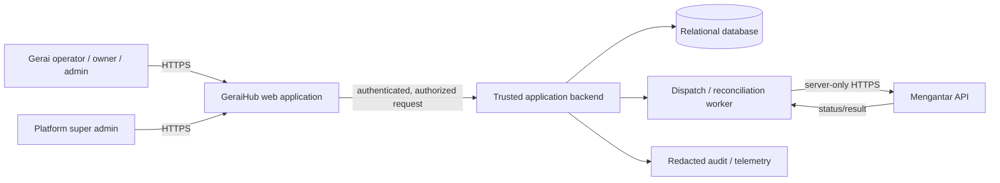

# GeraiHub System Architecture

## Document Control

| Field | Value |
|---|---|
| Status | Draft target architecture |
| Version / updated | 0.2 / 2026-09-23 |
| Authority | Canonical repository specification; promoted from the retained planning snapshot on 2026-09-23 |

## 1. Architecture Drivers

GeraiHub is a multi-organization, multi-branch Indonesian shipment-operations application. It requires strict branch isolation, trusted Mengantar integration, physically verified counter workflow, provider-state reconciliation, and auditability. A modular monolith plus relational database is the smallest design that meets those needs; separate microservices are not justified for MVP.

## 2. Target Container View

| ID | Owner | Review | Container | Responsibility | State |
|---|---|---|---|---|---|
| ARCH-1 | Engineering owner | Architecture review pending before implementation | Web application | Operator/admin/governance UI; explicit active-branch selection | No authoritative business state |
| ARCH-2 | Engineering owner | Security review pending before implementation | Application backend | Auth, policy, shipment transitions, provider adapter, read APIs | Stateless runtime |
| ARCH-3 | Engineering owner | Data/privacy review pending before migration | Relational database | Organization/branch/membership, shipments, provider mappings, audit, reconciliation data | System operational state |
| ARCH-4 | Engineering owner | Provider contract review pending before dispatch | Worker | Bounded asynchronous provider dispatch/retry/reconciliation | Job/outbox/sync state in database |
| ARCH-5 | Engineering owner | Provider account-owner review pending | Mengantar | Provider estimate/order/label/cancellation/status and authoritative finance/settlement | External source of truth |
| ARCH-6 | Operations owner | Privacy review pending before deployment | Telemetry/audit sink | Redacted reliability/security evidence | Policy-controlled records |

## 3. Trust Boundaries

| Flow | Boundary/control |
|---|---|
| Browser → backend | Authentication, CSRF/session policy, action authorization, server-derived branch context, input validation/rate limiting. |
| Backend → database | Branch ownership constraints, transaction/idempotency, least-privilege database identity. |
| Backend/worker → Mengantar | Server-only credential retrieval; sanitized logs; timeout/retry/correlation; current contract verification. |
| Platform support → branch data | Default-deny; approved JIT branch scope, expiry, visible mode, immutable audit. |
| Telemetry | Redact credentials, URLs, payment/customer payloads; tenant/branch identifiers follow privacy policy. |

## 4. Deployment and Reliability Boundaries

- Provider requests must not occur from browsers.
- A failed web request must not imply provider submission failed; provider correlation/reconciliation decides ambiguous outcomes.
- The worker may be co-deployed with the app for MVP but remains a separate responsibility/queue boundary in code and observability.
- Database backup, restore, storage/processing region, access, and retention remain infrastructure/privacy decisions before production.
- Printing is an application action after label confirmation; local printer installation/spooler details are not assumed by this architecture.

## 5. Explicitly Deferred

- Public customer pre-fill/QR service and WhatsApp messaging.
- Cross-branch operational queues and bulk actions.
- GeraiHub-managed wallet, COD settlement, provider-financial adjustment, or payment gateway.
- Microservices, event bus, warehouse, or real-time tracking unless measured demand requires them.
