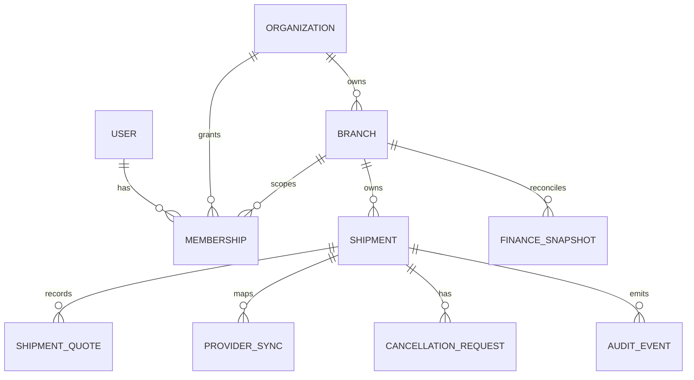

# GeraiHub Data Model

## Document Control

| Field | Value |
|---|---|
| Status | Draft — logical model |
| Version / updated | 0.2 / 2026-09-23 |
| Database/runtime | PostgreSQL + Drizzle proposed; accept under T-2 before implementation |
| Design principle | Mengantar owns provider/settlement truth; GeraiHub stores scoped operational records, provider snapshots, and reconciliation evidence. |
| Authority | Canonical repository specification; promoted from the retained planning snapshot on 2026-09-23 |

## 1. Core Ownership Model

| ID | Owner | Entity | Scope | Purpose |
|---|---|---|---|---|
| DATA-1 | Engineering owner | Organization | Global business boundary | Owner account that may operate multiple branches. |
| DATA-2 | Engineering owner | Branch (gerai) | Organization | Physical operational boundary; owns shipment work, configuration, and branch memberships. |
| DATA-3 | Engineering owner | User | Global identity | One identity; never duplicated per branch. |
| DATA-4 | Engineering owner | Membership | Organization and/or branch | Role assignment and lifecycle for owner, admin, staff pengiriman, finance viewer. |
| DATA-5 | Engineering owner | Shipment | Branch | Immutable branch-owned operational shipment aggregate. |
| DATA-6 | Engineering owner | Shipment quote/version | Shipment | Estimate/final quote history and quote-confirmation evidence. |
| DATA-7 | Engineering owner | Provider sync | Shipment | Idempotent Mengantar submission/status/label/cancellation synchronization evidence. |
| DATA-8 | Engineering owner | Cancellation request | Shipment | Local request and authoritative provider outcome; never a local assertion that provider cancellation succeeded. |
| DATA-9 | Engineering owner | Finance snapshot/reconciliation item | Branch/shipment | Read-only provider backup, mismatch, and internal estimate inputs; not official settlement truth. |
| DATA-10 | Engineering owner | Audit event | Organization/branch/resource | Append-only operational and privileged-access evidence. |

Identity lifecycle also requires GeraiHub-owned provider-account links, invitations, sessions, and JIT grants. The selected auth adapter owns its physical auth tables, not business authorization. Provider accounts bind a unique provider/issuer/subject to one internal user; email changes never relink that identity. Invitations record intended identity policy, scope/role, inviter, expiry, one-time acceptance/revocation, and resulting provider subject. Invitation consumption and membership creation must be atomic; concurrent acceptance cannot create duplicate grants. Store no Google API access/refresh tokens for this MVP. Final column names and adapter constraints require installed-version review before migration.

## 2. Identity and Scope Constraints

- `organizations.id`, `branches.id`, `users.id`, and `shipments.id` are opaque internal identifiers. Do not expose them as public customer references.
- Every branch has `organization_id NOT NULL`; every shipment has `organization_id` and `branch_id NOT NULL`, with an enforcement rule that the branch belongs to that organization.
- Every membership references exactly one user and one organization; branch-scoped memberships additionally reference one branch within that organization. Owner membership is organization-scoped; daily roles are normally branch-scoped.
- A unique active membership constraint must prevent duplicate active grants for the same user/role/scope while allowing intentional different roles in different branches only when IAM policy permits.
- Branch and organization IDs are never reused after retirement/deletion.

## 3. Shipment Model and State Separation

A shipment has separate state dimensions. Do not collapse them into one mutable `status` string:

| Dimension | Representative values | Authority |
|---|---|---|
| Operational lifecycle | draft, quoted, payment_recorded, submission_pending, submitted, label_printed, awaiting_pickup, picked_up, cancelled | GeraiHub transition policy, constrained by provider result where applicable |
| Provider sync | not_started, pending, confirmed, failed, unknown, reconciliation_required | Mengantar request/result reconciliation |
| Cancellation | not_requested, local_draft_cancelled, requested, pending_provider, succeeded, rejected, unknown | Mengantar authoritative after provider request |
| Financial/reconciliation | not_applicable, snapshot_fresh, stale, mismatch, reviewed | Mengantar authoritative data versus GeraiHub backup |

Required shipment fields include: branch ownership, sender/recipient and package details allowed by the current integration contract, selected service/COD attributes, customer charge before cashback, current operational state, provider state, lifecycle timestamps, and row-version/concurrency control. Personal data classification/retention is defined by Privacy; this document does not prescribe final retention periods.

## 4. Quote, Payment, and Provider Integrity

| Rule | Enforcement direction |
|---|---|
| Every material quote change creates a versioned quote record; final confirmation references its exact version. | Immutable quote history; transactionally update current quote pointer. |
| Direct payment recording is an operational fact, not evidence of Mengantar settlement. | Append-only cash/QRIS payment record and admin-request/owner-decision correction model under Q-3 and BILL-1 through BILL-4; external refunds remain separate audited events. |
| Provider submission has a branch-scoped idempotency key and provider request correlation. | Unique constraint and transaction/outbox or equivalent safe dispatch design. |
| A confirmed provider tracking number/resi maps to at most one GeraiHub shipment within the applicable provider/account scope. | Unique provider mapping constraint after current provider contract is confirmed. |
| Reprint references an existing confirmed label/provider mapping and creates audit evidence only. | No order-create side effect. |
| Cancellation retains original shipment, label/resi, request, reason, and provider result. | No destructive delete/update of history. |
| Internal estimated profit is derived only from eligible `picked_up` shipment evidence and snapshots the calculation inputs/version. | Derived/report table or reproducible query; explicit estimate disclaimer. |

## 5. Customer Pre-fill, Post-MVP

A pre-fill draft adds a customer-facing lookup reference separate from the internal shipment ID and future Mengantar resi:

| Field/constraint | Contract |
|---|---|
| `public_draft_reference` | Short, non-sequential, human-readable, case-normalized code; avoid ambiguous characters; globally unique among unexpired/retrievable drafts. |
| QR payload | Contains only a versioned opaque draft-reference locator, never sender/recipient/contact/address or credentials. |
| Lookup | Branch-scoped after operator context is established. QR and manual entry resolve the same reference. |
| Fallback phone lookup | Operator-only, authorized branch, rate-limited, minimized result; name-only lookup is prohibited. |
| Expiry | State/expiry timestamp preserves audit record; draft is marked expired, not silently deleted. Q-5 sets end-of-next-business-day expiry; timezone/business calendar/cutoff and retention must be resolved before post-MVP implementation. |

## 6. Query and Index Priorities

| Use case | Mandatory scope/filter | Index direction |
|---|---|---|
| Branch shipment queue | `branch_id`, lifecycle/sync state, recency | `(branch_id, operational_state, updated_at DESC)` plus measured variants |
| Shipment detail | `branch_id`, shipment ID | Composite ownership lookup |
| Provider reconciliation | provider sync state, next attempt/updated time, branch | Pending-state queue index |
| Resi lookup | authorized branch + provider tracking number | Branch/provider unique lookup |
| Pre-fill lookup | active branch + public reference | Scoped unique/lookup index |
| Organization aggregate report | organization + time range; no shipment mutations | Reporting index/materialization only after measured need |

Indexes are logical candidates; validate with real query plans and expected workload before migration.

## 7. Migration Sequence

1. Create organization, branch, user, and membership model first.
2. Establish branch-scoped shipment ownership and authorization before adding operational flows.
3. Add quote/provider-sync/audit models with idempotency and append-only correction rules.
4. Add reconciliation/estimated-profit views after provider status/pickup contract is verified.
5. Add public draft reference/QR only for the approved post-MVP phase; do not expose a public lookup before abuse and privacy tests pass.
