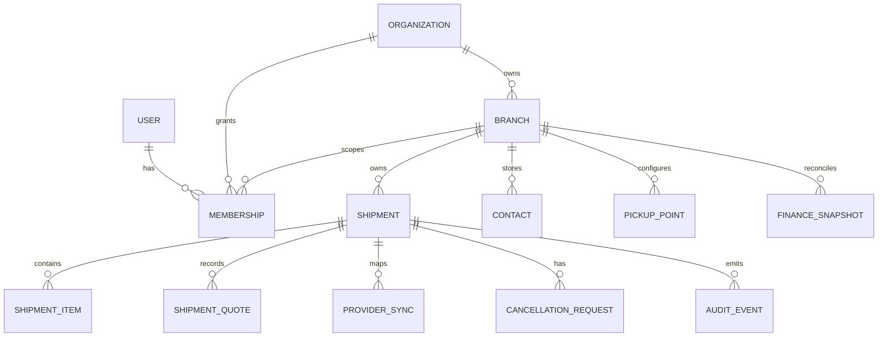

# GeraiHub Data Model

## Document Control

| Field | Value |
|---|---|
| Status | Accepted logical/physical baseline; migration/runtime evidence pending |
| Version / updated | 0.3 / 2026-09-24 |
| Database/runtime | PostgreSQL + Drizzle accepted under ADR-001; exact package versions and generated SQL remain T-1/T-3 evidence |
| Design principle | Mengantar owns provider/settlement truth; GeraiHub stores scoped operational records, provider snapshots, and reconciliation evidence. |
| Authority | Canonical repository specification; promoted from the retained planning snapshot on 2026-09-23 |

## 1. Core Ownership Model

| ID | Owner | Entity | Scope | Purpose |
|---|---|---|---|---|
| DATA-1 | Engineering owner | Organization | Global business boundary | Owner account that may operate multiple branches. |
| DATA-2 | Engineering owner | Branch (gerai) | Organization | Physical operational boundary; owns shipment work, configuration, and branch memberships. |
| DATA-3 | Engineering owner | User | Global identity | One identity; never duplicated per branch. |
| DATA-4 | Engineering owner | Membership | Organization and/or branch | Role assignment and lifecycle for owner, admin, staff pengiriman, finance viewer. |
| DATA-5 | Engineering owner | Shipment | Branch | Immutable branch-owned operational shipment aggregate. |
| DATA-6 | Engineering owner | Shipment quote/version | Shipment | Estimate/final quote history and quote-confirmation evidence. |
| DATA-7 | Engineering owner | Provider sync | Shipment | Idempotent Mengantar submission/status/label/cancellation synchronization evidence. |
| DATA-8 | Engineering owner | Cancellation request | Shipment | Local request and authoritative provider outcome; never a local assertion that provider cancellation succeeded. |
| DATA-9 | Engineering owner | Finance snapshot/reconciliation item | Branch/shipment | Read-only provider backup, mismatch, and internal estimate inputs; not official settlement truth. |
| DATA-10 | Engineering owner | Audit event | Organization/branch/resource | Append-only operational and privileged-access evidence. |

Identity lifecycle also requires GeraiHub-owned provider-account links, invitations, sessions, and JIT grants. The selected auth adapter owns its physical auth tables, not business authorization. Provider accounts bind a unique provider/issuer/subject to one internal user; email changes never relink that identity. Invitations record intended identity policy, scope/role, inviter, expiry, one-time acceptance/revocation, and resulting provider subject. Invitation consumption and membership creation must be atomic; concurrent acceptance cannot create duplicate grants. Store no Google API access/refresh tokens for this MVP. Final column names and adapter constraints require installed-version review before migration.

## 2. Identity and Scope Constraints

- `organizations.id`, `branches.id`, `users.id`, and `shipments.id` are opaque internal identifiers. Do not expose them as public customer references.
- Every branch has `organization_id NOT NULL`; every shipment has `organization_id` and `branch_id NOT NULL`, with an enforcement rule that the branch belongs to that organization.
- Every membership references exactly one user and one organization; branch-scoped memberships additionally reference one branch within that organization. Owner membership is organization-scoped; daily roles are normally branch-scoped.
- A unique active membership constraint must prevent duplicate active grants for the same user/role/scope while allowing intentional different roles in different branches only when IAM policy permits.
- Branch and organization IDs are never reused after retirement/deletion.

## 3. Shipment Model and State Separation

A shipment has separate state dimensions. Do not collapse them into one mutable `status` string:

| Dimension | Representative values | Authority |
|---|---|---|
| Operational lifecycle | draft, quoted, submission_pending, submitted, label_print_requested, awaiting_pickup, picked_up, cancelled | GeraiHub transition policy, constrained by provider result where applicable |
| Provider sync | not_started, pending, confirmed, failed, unknown, reconciliation_required | Mengantar request/result reconciliation |
| Cancellation | not_requested, local_draft_cancelled, requested, pending_provider, succeeded, rejected, unknown | Mengantar authoritative after provider request |
| Financial/reconciliation | not_applicable, snapshot_fresh, stale, mismatch, reviewed | Mengantar authoritative data versus GeraiHub backup |

Required shipment fields include: branch ownership, sender/recipient and package details allowed by the current integration contract, selected service and counter collection mode, shipping-charge allocation, verified shipping charge before cashback, intended provider COD amount when applicable, current operational state, provider state, lifecycle timestamps, and row-version/concurrency control. Personal data classification/retention is defined by Privacy; this document does not prescribe final retention periods.

### Counter input snapshots

A saved draft may be incomplete, including zero item rows, so the operator can resume safely. Ownership and input-format/range validation always apply; complete pickup/contact/item/package fields and at least one valid item become mandatory before a quote or submit. Never treat a successfully saved draft as ready for dispatch.

- `pickup_points` are approved, branch-owned origin configurations. A draft selects its active gerai pickup point by default; only configured points of that branch are selectable. Shipment submission snapshots the selected point and validated provider mapping. Changing an origin before submission invalidates estimate and final quote. The provider contract, not an assumed endpoint, determines which pickup fields can be sent.
- `contacts` are branch-owned reusable sender/recipient address-book entries. An operator can search an existing entry by bounded name/phone query or create a new one. Search returns minimal masked results until a specific record is selected. A chosen contact is copied into shipment sender/recipient snapshots; later address-book edits do not rewrite old shipments. Same contact may be used in either role. Saving a contact for reuse is explicit; entering shipment data alone does not create or overwrite an address-book entry. Duplicate matches are disambiguated by masked phone/address summary, never silently merged.
- `shipment_items` are branch/shipment-owned snapshots with a bounded description, positive integer quantity, and exact integer IDR declared unit value. Each line total is quantity times unit value; declared goods total is the exact sum of line totals, calculated server-side. At least one valid line is required before estimate/submit; an incomplete saved draft may have none. These values describe parcel contents; they are distinct from shipping charge and any COD amount. Provider-required contents/declaration fields and limits remain T-10 evidence gates.
- Counter mode is one constrained value: `non_cod`, `cod_shipping`, or `cod_product`. Product COD has an explicit `include_shipping_in_cod` choice. Store the resulting shipping-charge allocation (`courier_cod` or `sender_at_gerai_manual`) and exact intended courier collection as submit-time snapshots beside, never instead of, declared goods total and verified shipping charge. Non-COD stores no courier collection and allocates shipping to the manual gerai process; shipping-only COD requests only shipping; product COD requests goods total plus shipping only when selected. Excluding shipping from product COD requires explicit sender-at-gerai allocation confirmation. Reject impossible combinations and integer overflow. Provider-confirmed collection semantics are separate finance snapshots, not a local paid flag.
- COD fee policy is versioned as a rational rate (`333 / 10,000`) against the intended COD amount. Store the base amount, rate numerator/denominator, and exact calculated fee numerator as estimate inputs; do not persist an assumed rounded IDR fee as provider truth. These are exact integer calculation inputs, not a fractional posted financial amount under ADR-004. Check input, product, sum, and persisted numerator ranges before accepting a value. Final integer-rupiah fee snapshots use the verified rounding/provider source only after GATE-COD-FEE closes. Non-COD has no COD fee.
- Sender, recipient, pickup point, items, COD, package measurements, and selected service are material quote inputs when they affect provider estimate/eligibility. Any such change before submission requires provider estimate revalidation and explicit final-charge confirmation. The submitted shipment retains immutable snapshots used by the provider operation, resi, and invoice.

## 4. Quote, Invoice, and Provider Integrity

| Rule | Enforcement direction |
|---|---|
| Every material quote change creates a versioned quote record; final confirmation references its exact version. | Immutable quote history; transactionally update current quote pointer. |
| Customer payment is manual outside GeraiHub. | No payment method, receipt, paid status, correction, or refund table/field; invoice is not payment evidence under Q-3 and BILL-1 through BILL-4. |
| An issued invoice snapshots one confirmed shipment/resi and quote version. | Branch-scoped unique invoice reference, immutable source links, shipping charge and collection allocation; reprint reuses the same record, issuance audited and idempotent. |
| Provider submission has a branch-scoped idempotency key and provider request correlation. | Unique constraint and transaction/outbox or equivalent safe dispatch design. |
| A confirmed provider tracking number/resi maps to at most one GeraiHub shipment within the applicable provider/account scope. | Unique provider mapping constraint after current provider contract is confirmed. |
| Reprint references an existing confirmed label/provider mapping and creates audit evidence only. | No order-create side effect. |
| Cancellation retains original shipment, invoice, label/resi, request, reason, and provider result. | No destructive delete/update of history. |
| Internal estimated profit is derived only from eligible `picked_up` shipment evidence and snapshots the calculation inputs/version. | Derived/report table or reproducible query; explicit estimate disclaimer. |

Quotes, durable provider operations and confirmed order mappings pin a non-secret provider-account mapping identity and configuration version. Replacing a branch account cannot redirect pending or historical operations to the replacement account, including cancellation/finance reads. Same-account credential rotation is resolved only through the approved server secret store. If the original account cannot be accessed safely, retain reconciliation-required status and escalate; a not-found result in another account is never no-order evidence. A draft using a changed provider-relevant configuration requires a new quote and confirmation.

Invoice issuance snapshots every rendered business field: issuing branch identity/address and issue timezone, authorized customer/service/route summaries, resi, charge/allocation, reference and issue time. Record the rendering-template version and keep that version reproducible, or retain an immutable generated artifact with protected access. Reprint must not join current branch/contact settings to rebuild original content. Cancellation context is separate from the immutable document. This does not require retaining provider credentials or unrestricted customer data.

## 5. Customer Pre-fill, Post-MVP

A pre-fill draft adds a customer-facing lookup reference separate from the internal shipment ID and future Mengantar resi:

| Field/constraint | Contract |
|---|---|
| `public_draft_reference` | Short, non-sequential, human-readable, case-normalized code; avoid ambiguous characters; globally unique among unexpired/retrievable drafts. |
| QR payload | Contains only a versioned opaque draft-reference locator, never sender/recipient/contact/address or credentials. |
| Lookup | Branch-scoped after operator context is established. QR and manual entry resolve the same reference. |
| Fallback phone lookup | Operator-only, authorized branch, rate-limited, minimized result; name-only lookup is prohibited. |
| Expiry | State/expiry timestamp preserves audit record; draft is marked expired, not silently deleted. Q-5 sets end-of-next-business-day expiry; timezone/business calendar/cutoff and retention must be resolved before post-MVP implementation. |

## 6. Query and Index Priorities

| Use case | Mandatory scope/filter | Index direction |
|---|---|---|
| Branch shipment queue | `branch_id`, lifecycle/sync state, recency | `(branch_id, operational_state, updated_at DESC)` plus measured variants |
| Shipment detail | `branch_id`, shipment ID | Composite ownership lookup |
| Provider reconciliation | provider sync state, next attempt/updated time, branch | Pending-state queue index |
| Resi lookup | authorized branch + provider tracking number | Branch/provider unique lookup |
| Pre-fill lookup | active branch + public reference | Scoped unique/lookup index |
| Organization aggregate report | organization + time range; no shipment mutations | Reporting index/materialization only after measured need |

Indexes are logical candidates; validate with real query plans and expected workload before migration.

## 7. Migration Sequence

1. Create organization, branch, user, and membership model first.
2. Establish branch-scoped shipment ownership and authorization before adding operational flows.
3. Add quote/provider-sync/audit models with idempotency and append-only correction rules.
4. Add reconciliation/estimated-profit views after provider status/pickup contract is verified.
5. Add public draft reference/QR only for the approved post-MVP phase; do not expose a public lookup before abuse and privacy tests pass.

## 8. Physical Schema Baseline

Exact Drizzle declarations and generated SQL are implementation artifacts. T-3 (identity/scope) and T-7 (shipment/invoice/provider) MUST preserve their portions of this minimum physical model.

### Common column rules

- Internal primary keys are opaque UUID-compatible identifiers; no sequential public customer identifier is exposed.
- Timestamps use timezone-aware PostgreSQL timestamps and are stored in UTC; UI/report grouping uses the branch IANA timezone.
- GeraiHub-owned IDR money uses exact integer rupiah storage compatible with PostgreSQL `BIGINT`, per ADR-004.
- Mutable aggregates include a monotonic `version BIGINT NOT NULL` starting at 1.
- Core authorization/state fields use constrained values through checked text/enum strategy selected in migration review; arbitrary free-text states are prohibited.
- Required ownership columns are `NOT NULL`; branch-owned child tables must be constrained back to the same shipment/organization/branch ownership.
- Generic soft-delete flags are not a substitute for explicit lifecycle states. Historical financial/provider/audit records are append-only or retired through explicit lifecycle records.
- Core relational invariants must not be hidden only inside JSON. JSON/JSONB may hold sanitized provider metadata only where its schema is adapter-versioned and not used as the sole authorization/financial source.

### Minimum table families

| Table family | Minimum purpose/invariant |
|---|---|
| `organizations` | Business ownership boundary and lifecycle |
| `branches` | Organization-owned operational boundary, timezone, activation lifecycle |
| auth-adapter tables | Better Auth physical identity/session/account tables after installed-version review |
| `users` / business user profile | GeraiHub-owned stable internal identity relation where needed by adapter design |
| `invitations` | Intended email/scope/role, expiry, one-time consumption/revocation, resulting provider subject |
| `memberships` | Organization/branch scoped roles with active lifecycle and duplicate-active-grant prevention |
| `platform_grants` / bootstrap control | Platform roles independent of tenant memberships; approved invitations and permanent bootstrap-completed marker; no runtime-created bootstrap authority |
| `jit_grants` | Named branch, requester, distinct approver, purpose, grant/expiry/revocation |
| `shipments` | Immutable organization/branch ownership, state dimensions, current quote pointer, version |
| `pickup_points` | Approved branch-scoped origin settings, provider mapping/readiness and lifecycle; shipment stores submit-time snapshot |
| `contacts` | Branch-scoped reusable sender/recipient details with explicit save/update and bounded search; not a cross-branch customer directory |
| `shipment_items` | Shipment-owned content/quantity/declared unit value and exact line totals; historical snapshots survive contact/catalog edits |
| `shipment_quotes` | Immutable quote versions and confirmation/freshness evidence |
| `invoices` | Immutable branch-scoped invoice reference, confirmed shipment/resi, quote version, exact charge, issue time and audit correlation; reprint reuses the row |
| `provider_operations` | Durable outbox/operation state, pinned account mapping/version, correlation, attempts, lease, durable dispatch-start marker, retry/reconciliation metadata |
| `provider_mappings` | Confirmed provider order/resi/label mapping under verified account scope |
| `cancellation_requests` | Request/reason and authoritative provider outcome history |
| `finance_snapshots` / reconciliation items | Non-authoritative provider snapshots/mismatch inputs |
| `audit_events` | Append-only redacted actor/scope/resource/action/outcome/correlation evidence |

### Mandatory uniqueness/constraint directions

- unique provider identity link on `(provider, issuer, subject)`;
- one-time invitation consumption enforced transactionally;
- no duplicate active membership for the same user/role/scope;
- branch must belong to shipment organization through composite ownership enforcement;
- child shipment records cannot reference another branch/organization;
- contact and pickup selections must belong to the active shipment branch; submitted contact, pickup and item snapshots cannot be rewritten by directory/configuration edits;
- at most one issued invoice per shipment in MVP, with a unique invoice reference and replay-safe issuance; a replacement requires an approved policy and schema change;
- one provider operation identity/correlation per logical side-effect intent;
- confirmed provider tracking/resi uniqueness within the verified provider/account scope;
- no invoice source link to a pending/unknown provider mapping.

Generated SQL must be reviewed in its owning task. Constraint names/index shape may change for PostgreSQL/Drizzle ergonomics, but weakening these invariants requires an ADR/spec change.

T-3 reviews and implements the identity/organization/branch/invitation/platform-grant portion only; T-7 owns shipment, quote, invoice and provider persistence. Each task reviews its own generated SQL. T-1 verifies the migration tooling against a disposable minimal schema; it does not pre-implement T-3/T-7 business tables.
